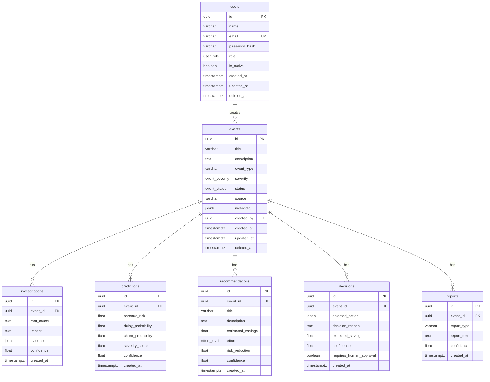

# Entity-Relationship Diagram

Athena AI decision-intelligence schema. `User` and `Event` support soft delete via `deleted_at`.

## Mermaid ER Diagram

## Cardinality

| Relationship | Cardinality | On delete |
| --- | --- | --- |
| `users` → `events` | 1:N | `RESTRICT` (cannot delete user with events) |
| `events` → `investigations` | 1:N | `CASCADE` |
| `events` → `predictions` | 1:N | `CASCADE` |
| `events` → `recommendations` | 1:N | `CASCADE` |
| `events` → `decisions` | 1:N | `CASCADE` |
| `events` → `reports` | 1:N | `CASCADE` |

## Enum Types

| PostgreSQL type | Values |
| --- | --- |
| `user_role` | `ADMIN`, `MANAGER`, `ANALYST`, `VIEWER` |
| `event_severity` | `LOW`, `MEDIUM`, `HIGH`, `CRITICAL` |
| `event_status` | `NEW`, `PROCESSING`, `RESOLVED`, `FAILED` |
| `effort_level` | `LOW`, `MEDIUM`, `HIGH` |

## Index Summary

| Table | Index | Purpose |
| --- | --- | --- |
| `users` | `ix_users_email` | Email lookups |
| `users` | `ix_users_email_active` (partial unique) | Active-email uniqueness with soft delete |
| `events` | `ix_events_status` | Status filtering |
| `events` | `ix_events_severity` | Severity filtering |
| `events` | `ix_events_created_by` | Creator lookups |
| `events` | `ix_events_created_at` | Chronological queries |
| `investigations` | `ix_investigations_event_id` | Event-scoped reads |
| `predictions` | `ix_predictions_event_id` | Event-scoped reads |
| `recommendations` | `ix_recommendations_event_id` | Event-scoped reads |
| `decisions` | `ix_decisions_event_id` | Event-scoped reads |
| `reports` | `ix_reports_event_id` | Event-scoped reads |
